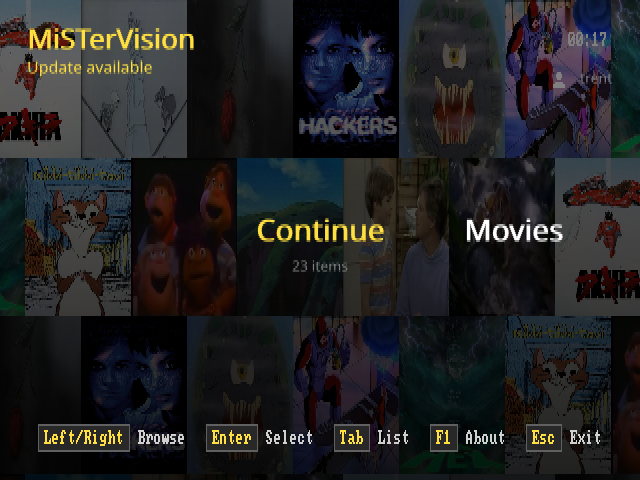
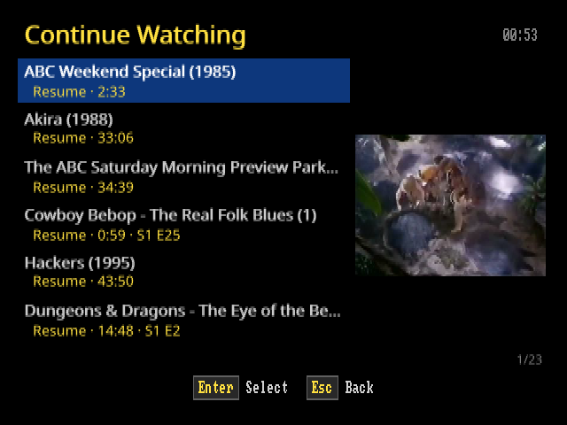
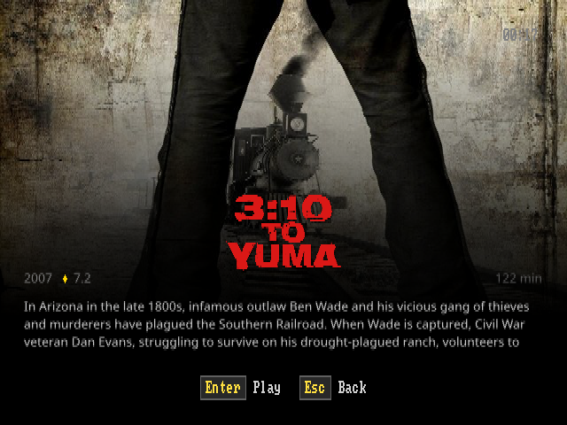
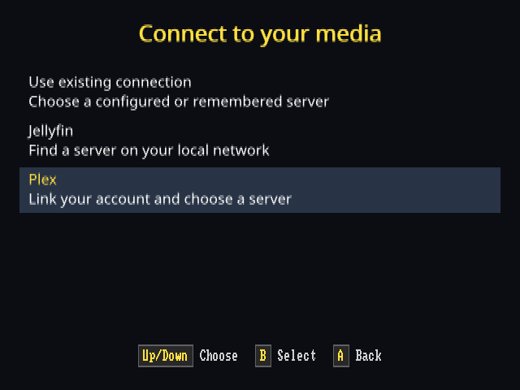
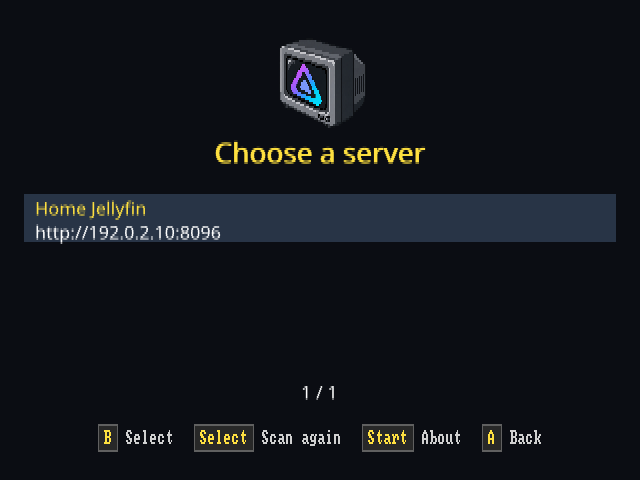
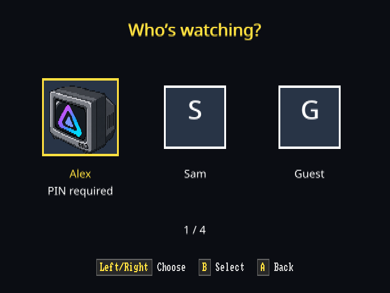
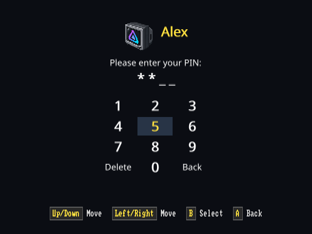
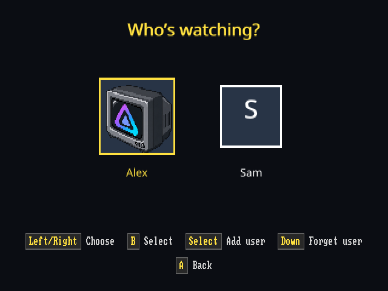
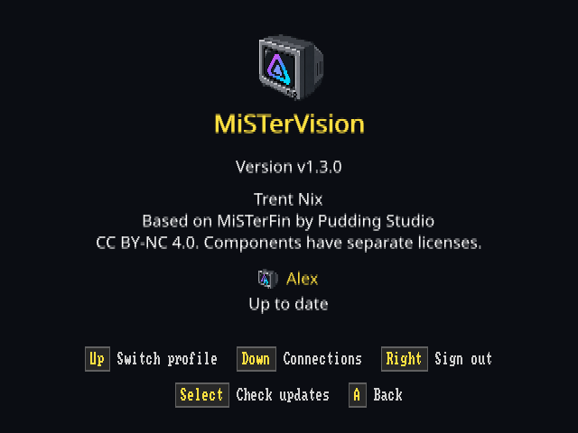

# MiSTerVision

<p align="center">
  
</p>

MiSTerVision is a Jellyfin and Plex client for MiSTer FPGA, designed for CRT televisions with support for HDMI displays. It supports movies, TV shows, live TV, music, photos, collections, and playlists through one interface.

Both providers share browsing and playback controls, server discovery, and saved connection switching. Jellyfin can switch saved Quick Connect users. Plex supports Home profiles with avatars and PIN entry. About also lets you forget a Jellyfin user or sign out of Plex on this device.

My goal is a great media experience on CRTs. I use a consumer 4:3 CRT television for everyday testing, including RGB, YPbPr component, and composite connections. I also test HDMI output. I have tested both server providers, including Jellyfin 12.

## Run on MiSTer

There is **one application package** for CRT and HDMI output. It keeps MiSTer’s current display mode and includes the core needed for optional interlaced output. You do not need a configuration file to discover and link a local server.

1. Install MiSTerVision using one method below.
2. Check the [display setup](#display-setup) for your connection.
3. Launch **MiSTerVision** from Scripts and [connect to a server](#connect-to-a-server).

### Install through update_all or Downloader

1. Download theypsilon’s [MiSTerVision database ZIP](https://raw.githubusercontent.com/theypsilon/MultiDatabases_MiSTer/db/mister-vision/downloader_MultiDatabases_mister-vision.zip).
2. Extract `downloader_MultiDatabases_mister-vision.ini` to `/media/fat/` on the SD card. This registers the database without replacing `downloader.ini`.
3. If MiSTerVision is running, exit it. Run `update_all` or MiSTer Downloader.

The database installs the application package and preserves existing settings and sign-in. Use the same updater for later releases. See the maintainer’s [database instructions](https://github.com/theypsilon/MultiDatabases_MiSTer/tree/main/mister-vision).

### Manual installation

1. Download `mistervision-vX.Y.Z-progressive.zip` from [Releases](https://github.com/trentnix/mistervision/releases).
2. If MiSTerVision is running, exit it. Extract the ZIP and copy its `Scripts` and `mistervision` directories to `/media/fat/`, merging with existing directories.
3. Keep existing configuration and state files. Copy the application and matching MPlayer together.

The result includes `/media/fat/Scripts/MiSTerVision.sh`, `/media/fat/mistervision/mistervision`, `/media/fat/mistervision/mplayer-arm`, and `/media/fat/mistervision/InterlacedMenu.rbf`. Keep the launcher filename free of spaces. Make the launcher and binaries executable if your filesystem requires it.

The filename retains `-progressive.zip` so existing updaters and Downloader continue to recognize it. This is the only application ZIP. It supports both display modes and preserves existing display settings.

Upgrading from v1.4.0 or earlier requires one Downloader or manual installation. For older MiSTerFin CRT installations, follow the [rename instructions](docs/GO_BUILD.md#moving-from-misterfin-crt). Unreleased changes require a [source build](docs/GO_BUILD.md).

### Updating

- **Downloader installation:** Exit MiSTerVision and run `update_all` or Downloader. About shows release information and directs you to the external updater.
- **Manual installation:** Open **About → View release → Install**. The app restarts after a successful update.

Updates preserve settings, sign-in, playback preferences, and caches. Do not mix update methods because Downloader can restore the version its database lists. To return to built-in updates, remove the MiSTerVision database registration and restart. See [update ownership and recovery](docs/GO_BUILD.md#application-updates).

## Display setup

MiSTerVision draws through the **Linux framebuffer**, including its menus and video. Unlike many game cores, it does not provide independent CRT and HDMI output. Choose one display setup for MiSTerVision. It cannot send a CRT picture to analog and a separate HD picture to HDMI at the same time.

HDMI scaling and automatic aspect handling are available starting with v1.5.0.

MiSTer video setups vary widely. I appreciate feedback on what works and what needs adjustment. When reporting a display issue, include your MiSTer hardware, display, cable or adapter, and relevant video settings.

If startup returns immediately to the menu, attach `/media/fat/mistervision/startup-error.log` to your report. The launcher saves this log automatically. See [startup logs](docs/GO_DIAGNOSTICS.md#automatic-launcher-log) for hangs, missing logs, and privacy guidance.

### CRT

Start with your working CRT timing and leave `display.interlaced` off. Analog output must show the Linux framebuffer through the scaler, using `vga_scaler=1` with timing and sync settings appropriate for your CRT and adapter. A working game-core picture alone does not verify the framebuffer route.

See the [CRT setup and tested composite settings](docs/GO_DISPLAY.md#composite-and-s-video-output). Back up `MiSTer.ini` before editing. Merge settings into its existing `[Menu]` section and preserve other core settings. Do not copy HD timing into a standard-definition CRT configuration.

#### Interlaced output

After verifying browsing and playback, a compatible CRT setup can try 480i for finer text and subtitles. Interlacing can introduce flicker.

Exit MiSTerVision and edit `/media/fat/mistervision/settings.json`, preserving other settings:

```json
{
  "display": {
    "interlaced": true
  }
}
```

The included core loads automatically. The normal menu returns on exit. Set `interlaced` to `false` to return to the default. No different package or launcher is needed. See [interlaced setup and recovery](docs/GO_DISPLAY.md#enable-or-disable-interlaced-output).

#### If the picture is wrong

- **“Either disable framebuffer … or enable scaler on VGA”**: keep `fb_terminal=1`. Enable `vga_scaler=1` with CRT-compatible timing. Disabling the framebuffer is not a fix for MiSTerVision.
- **Blank or rolling picture**: check the adapter’s RGB/component/composite requirements, sync switches, and NTSC/PAL settings. Return to the last working configuration before trying another mode.
- **Clipped text or edges**: check overscan and `vscale_border`. The tested example’s border value may need adjustment for your television.
- **Trouble after enabling interlacing**: exit the app, set `display.interlaced` to `false`, and relaunch. If you cannot see the menu, edit the setting through SSH or on the SD card and restart MiSTer.

### HDMI

Use an HDMI timing supported by your display. Keep `display.interlaced` off, `display.aspect_ratio` on `"auto"`, and framebuffer limits at their defaults. See the [HDMI settings example](docs/GO_DISPLAY.md#hdmi-output).

At 720p or 1080p HDMI timing, MiSTerVision uses a 640×360 framebuffer. MiSTer’s hardware scaler enlarges it to the HDMI output resolution. This framebuffer serves the entire application, including browsing and playback. Backgrounds fill widescreen displays throughout the interface, and the carousel shows more neighboring libraries across the full width. Other foreground content and playback overlays keep a centered 4:3 layout. Video uses the screen’s aspect without stretching the source.

#### If the picture or playback is wrong

- **Blank screen after using a CRT**: replace the CRT-specific `[Menu]` timing with a supported HDMI timing and use `direct_video=0`. Keep application interlacing off. Reload the Menu core after editing `MiSTer.ini`.
- **Live TV drops frames**: remove custom framebuffer limits, or set `framebuffer_max_width` to `640` and `framebuffer_max_height` to `480` in the `display` section. Restart and compare the same channel. A 960×540 framebuffer reduced Live TV smoothness in testing.
- **Wrong video proportions**: Auto infers aspect from framebuffer geometry, not connector detection. Set `display.aspect_ratio` to `"4:3"` or `"16:9"` if that inference is wrong. Check the display’s own stretch or zoom settings too.
- **Analog CRT does not show the HDMI picture**: MiSTerVision has no independent dual-output path. Do not enable the analog scaler with HD timing on a standard-definition CRT. See [output limitations](docs/GO_DISPLAY.md#simultaneous-analog-and-hdmi-output).

## Connect to a server

With no saved or explicit connection, the app starts Jellyfin discovery.

- **Jellyfin:** Select a server and approve its Quick Connect code in a signed-in Jellyfin client. See [discovery troubleshooting](docs/GO_BROWSING.md#jellyfin-discovery) if no server appears.
- **Plex:** Open About with Start, choose **Connections**, then **Plex**. Approve the code at [plex.tv/link](https://plex.tv/link), choose a Home viewer if offered, and select a server. Plex prefers a reachable local address. Linking and Home profile checks require internet access.

The last successful connection opens automatically. Use **About → Connections → Use existing connection** to switch servers. Only the active connection accepts remote commands. Back cancels setup and returns to the previous connection when one is available.

### Specify an address

Discovery needs no JSON. For a remote server or fixed address, add a `server` section to `settings.json` without replacing other settings:

```json
{
  "server": {
    "provider": "jellyfin",
    "url": "http://your-jellyfin-server:8096"
  }
}
```

For Plex, use `"provider": "plex"` and your server address, normally `http://your-plex-server:32400`. Explicit addresses stay fixed. See [connection configuration](docs/GO_CONFIGURATION.md#server-connection).

### Switch connections or users

About offers **Switch profile** when multiple saved Jellyfin users or Plex Home viewers are available. Jellyfin’s **Add user** opens Quick Connect. Approve the code as the user you want to add. Protected Plex viewers enter their PIN after an application restart.

**Forget user** removes a saved Jellyfin user. **Sign out** removes the linked Plex sign-in on this device. Both require confirmation and leave server accounts and media intact. Back from a profile picker returns to About without changing users. See [Jellyfin users](docs/GO_BROWSING.md#jellyfin-users), [Plex Home](docs/GO_PLEX.md#plex-home-profiles), and [multiple connections](docs/GO_CONFIGURATION.md#multiple-connections).

## Controls


I test with an Xbox controller. The default layout follows MiSTer: B selects, plays, or pauses, and A goes back, cancels, or stops. Use the D-pad or left analog stick to navigate. During video or music playback, any direction shows or hides controls. Triggers seek, and shoulder buttons change music tracks.

Controller mappings are configurable in the `input` section of `settings.json`. For example, if you prefer A to select and B to go back, add this section while preserving your other settings:

```json
{
  "input": {
    "profiles": [
      {
        "match": "*Xbox*",
        "buttons": {
          "304": "open",
          "305": "back"
        }
      }
    ]
  }
}
```

The numbers are Linux input event codes. For a standard Xbox mapping, `304` is A (`BTN_SOUTH`) and `305` is B (`BTN_EAST`). Other controllers or drivers can report different codes. Use an input inspector such as `evtest` to read the code when you press a button. See [finding device names and button codes](docs/GO_INPUT.md#finding-device-names-and-button-codes).

Restart after editing. Unspecified bindings keep their defaults. See the [input guide](docs/GO_INPUT.md) for device matching, axes, and labels.

The [playback guide](docs/GO_PLAYBACK.md#playback-controls) lists controller and keyboard controls. [About](docs/GO_BROWSING.md#about-and-updates) shows the installed version and provides [updates](#updating).

To control playback from another Jellyfin client, select **MiSTerVision** as the playback device. Remote play, queues, pause/resume, seeking, shuffle, and repeat are supported. See [remote control](docs/GO_REMOTE.md).

## Configuration


Connection and application settings live in **`settings.json`**, normally `/media/fat/mistervision/settings.json` on MiSTer. Both providers use `server.provider`, `server.url`, `server.insecure_tls`, and `server.transcode`. Use [settings.example.json](settings.example.json) as a reference. A discovered connection does not require copying the example. Preserve existing settings when editing. Omitted optional fields use defaults. Restart after changing settings.

| Setting | Defaults and options | Guide |
| --- | --- | --- |
| `connections.profiles` | No configured entries. Discovered connections are remembered automatically. Add up to 16 named server connections. | [Connections](docs/GO_CONFIGURATION.md#multiple-connections) |
| `server` | Provider: `jellyfin`. URL required when the section exists. TLS verified. Transcode limits: 720×576 at 12 Mbps. | [Connection](docs/GO_CONFIGURATION.md#server-connection) |
| `ui.title` | Heading: `MiSTerVision`. An explicit empty `title` hides it. Long titles are truncated. | [Title](docs/GO_CONFIGURATION.md#browsing-title) |
| `ui.show_collections`, `ui.show_playlists` | Both `true`. Show nonempty categories. Set either to `false` to hide its card. | [Carousel](docs/GO_CONFIGURATION.md#carousel-categories) |
| `ui.navigation_sounds` | `enabled: true`, `volume: 10` out of 100. False or volume zero silences navigation sounds. | [Sounds](docs/GO_CONFIGURATION.md#navigation-sounds) |
| `background` | Generated carousel mosaics and item artwork on lists. `image` selects one custom background. | [Background](docs/GO_CONFIGURATION.md#browsing-background) |
| `display` | `interlaced: false`, `aspect_ratio: "auto"`, framebuffer ceiling 640×480. Keep these defaults for initial use. | [Display](docs/GO_DISPLAY.md) |
| `input` | Built-in controller mappings and button labels. Profiles override matching devices. | [Input](docs/GO_INPUT.md) |
| `music_visuals` | Music playback appearance only. Artwork first, then `default_background: "Starfield"` when no backdrop is available. Manual choices persist until exit. Missing optional Toasty sprites are omitted. | [Music visuals](docs/GO_MUSIC.md) |
| `diagnostics` | Off. Legacy `DEBUGLOG` applies only without a `server` section. Path: `debug.log`. Limit: 1 MiB per file. | [Diagnostics](docs/GO_DIAGNOSTICS.md) |

Existing installations can retain legacy settings or [migrate them into one file](docs/GO_CONFIGURATION.md#migration). Migration preserves the original files. Invalid connection settings stop startup, while recoverable UI settings use the defaults documented in the [configuration guide](docs/GO_CONFIGURATION.md#application-settings).

### Browsing background

To use one custom image on the carousel and browsing lists, set `background.image` in `settings.json`:

```json
{
  "background": {
    "image": "background.png"
  }
}
```

Place the image in the same directory, or use an absolute path. PNG and JPEG are supported, up to 4 MiB and 2048 pixels in either dimension. Use an image that suits your display’s 4:3 or 16:9 proportions. The client crops it to fill the display and dims it to keep the interface readable. Restart to apply changes. An omitted or empty `image` keeps the normal artwork.

The client checks the file contents, not its extension. A video, text file, unsupported image format, or corrupt image is rejected. Missing or invalid image files fall back to the normal artwork with a brief on-screen notice. With diagnostics enabled, the fallback also records a `configuration.fallback` event. Startup continues.

### Sounds and caches

To turn off navigation sounds, set `ui.navigation_sounds`:

```json
{
  "ui": {
    "navigation_sounds": {
      "enabled": false
    }
  }
}
```

Sound settings affect browsing feedback only. They do not change music or video volume.

`MISTERVISION_CACHE_ROOT` changes where artwork and carousel collages are cached. The default root is `/media/fat` on MiSTer, `/tmp/mistervision-cache` in the Ghostty harness, and the user’s cache directory (usually `~/.cache`) for direct desktop runs. To keep the Ghostty cache across reboots, set `MISTERVISION_CACHE_ROOT="$HOME/.cache"` before launching the harness. The client stores caches under `mistervision` within that directory. See [artwork caching](docs/GO_BROWSING.md#persistent-artwork-cache) for details.

## Local development and testing

I use the Ghostty harness on Linux to develop and test the interface without MiSTer hardware. It also helps verify that the architecture supports different display pipelines while reusing the same UI and application logic. From the repository directory, run the browsing demo:

```bash
python3 tools/ghostty/ghostty_harness.py --demo --ntsc
```

The harness builds the client automatically. The demo uses mock data and does not play media. See the [development harness guide](tools/ghostty/README.md) for dependencies, copyable Jellyfin discovery and Plex connection commands, separate configuration profiles, and playback inside Ghostty.

## Server support and limits

Jellyfin supports remote control from other Jellyfin clients. Plex supports local DVR Live TV with alternate audio when the stream provides it. Both providers share playback controls, music visuals, picture modes, captions, and the photo viewer.

Search, automatic photo slideshows, and photo zoom are not implemented. Plex relay connections, remote control, multi-file movies, and free online TV are not supported. See [Plex details](docs/GO_PLEX.md) and [current limits](docs/README.md#current-limits).

## Deferred work

See the [Jellyfin and Plex gap analysis](docs/GAP_ANALYSIS.md) for missing features, current limitations, and intentional exclusions.

- **Broader controller support:** Testing more controllers, recognizing controller families, and showing their button labels automatically are potential future improvements. Other controllers may need a custom input profile today.
- **PAL 288p/576i validation:** Someone with PAL hardware will need to validate output. My hardware testing covers NTSC CRT output, including direct YPbPr component, and HDMI. See [tested display configurations](docs/GO_DISPLAY.md#how-i-test-display-changes).
- **Zaparoo DDR integration:** Deferred until I have a way to test it. Zaparoo is not required for the supported interlaced output.
- **MiSTer background-music hardware validation:** Suspension and restoration are implemented and covered by automated tests. Testing with the actual add-on is deferred because I do not use it. This is separate from music played through Jellyfin or Plex.

## More information

See the [documentation index](docs/README.md) for all guides and current limits.

- [Browsing, Continue Watching, and artwork caches](docs/GO_BROWSING.md)
- [Playback and controls](docs/GO_PLAYBACK.md)
- [Subtitles, audio tracks, and picture modes](docs/GO_PLAYBACK.md#video-options)
- [Builds and tests](docs/GO_BUILD.md)
- [Rendering architecture](docs/GO_RENDERING.md)

## Screenshots

These older captures show the v1.4.0 interface. v1.6.0 adds full-width widescreen backgrounds and carousel navigation, plus a revised music layout. Browsing captures come from the desktop harness. Setup previews use example names, addresses, approval codes, and a sample avatar. Controller and keyboard hints follow the active input device.



| Continue Watching | Movie details |
| --- | --- |
|  |  |
| **Choose a connection** | **Discover Jellyfin** |
|  |  |
| **Plex Home viewers** | **Protected profile** |
|  |  |
| **Saved Jellyfin users** | **About and Plex sign-out** |
|  |  |

The home carousel and root List view share library counts and show the active viewer and an update notice when available. Live TV lists show current and upcoming programs when the server supplies guide data. Shows with a single season open directly to their episodes. See [browsing behavior](docs/GO_BROWSING.md).

Interface text uses the same smooth font as captions. Navigation hints and the clock keep the bitmap font.

The [full gallery](docs/SCREENSHOTS.md) also shows the home List view, account linking, server selection, the movie list, setup help, and About.

## Origins and license

I started this project as MiSTerFin CRT, a Go port of [MiSTerFin](https://github.com/puddingstudio/MiSTerFin) by Pudding Studio, including my [C changes](https://github.com/trentnix/MiSTerFin). I maintain it independently. It remains heavily based on MiSTerFin, an excellent project.

Original MiSTerFin material is copyright © 2026 Pudding Studio. My additions and modifications are copyright © 2026 trentnix. I distribute the application under [CC BY-NC 4.0](LICENSE), except for components covered by [separate licenses](docs/THIRD_PARTY.md), including the GPL-licensed MPlayer.
