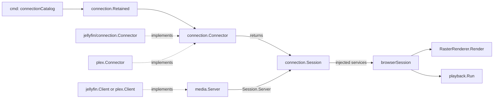
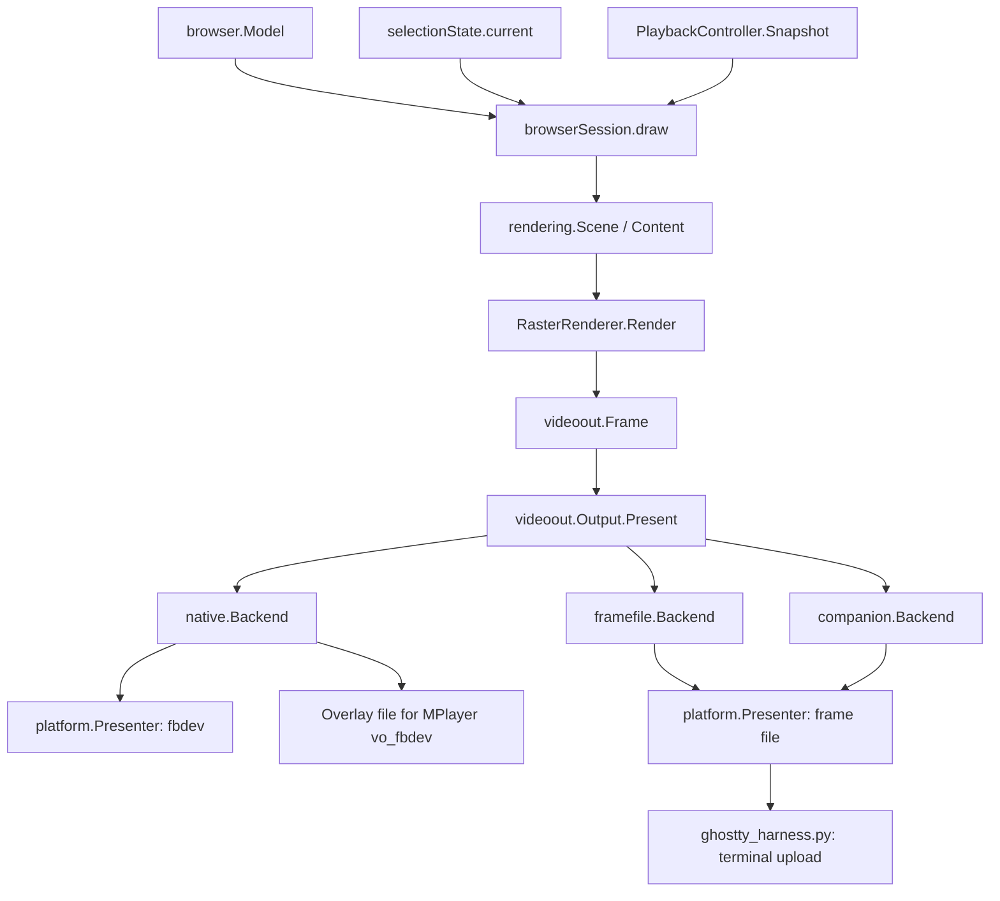
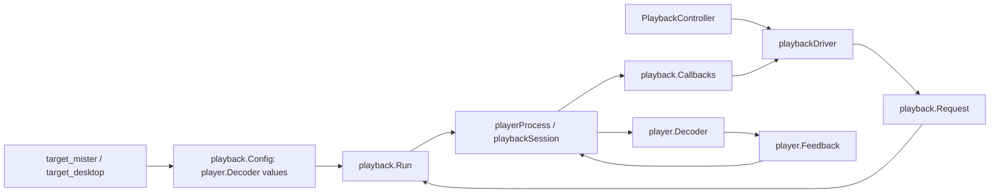

# Architecture

The browser owns navigation and playback UX. The renderer turns a read-only scene into shared pixels. Output backends handle presentation. Decoder implementations handle player protocols. Target assembly connects those parts without selecting output behavior inside the renderer.

## Media services

Application assembly selects Jellyfin by default or the [Plex adapter](GO_PLEX.md). Both implement [`connection.Connector`](../internal/connection/connector.go), authenticate, and return account services and an optional remote-control source. Discovery sessions also return public server metadata in `Session.Endpoint`. The connection catalog uses that value to update its menu without reopening provider state files. The browser serializes attempts and receives safe setup text. Rendering handles connection progress, server selection, approval codes, viewing profiles, masked PIN entry, and failures.

`connection.Interaction` supplies progress, cancellable server/profile choices, and confirmations. The browser sends an immutable prompt to its event loop and replies through a one-use channel. Generation checks reject stale prompts. Neither the renderer nor the discovery adapter handles physical input.

`connectionManager` serializes connection and local removal workers. Removal keeps the browser open while the provider prepares confirmation, blocks remote commands, and cancels pending remote media lookups. Confirmation takes priority over global Menu input. Background sign-in failures wait until the removal decision finishes. Cancel restores About unless a deferred failure requires sign-in recovery.

Providers report `connection.ErrSignedOut` after committing removal, which invalidates retained sessions and pending browser results even if later cleanup fails. Retry finishes that cleanup before opening fresh sign-in. About keeps account-action failures separate from release status so background update checks cannot hide them.

`Session.ProfileAction` offers one viewer action: choose, add, or none. The browser carries the chosen action back through `connection.Change` and `Interaction`. `Presentation.Back` identifies the preceding setup screen and survives progress and failures. The application retains the current session until a replacement succeeds, so canceling a profile change restores About on the previous connection.

Jellyfin's [`Client.Authenticate`](../internal/jellyfin/authenticate.go) returns verified user metadata without writing files. Its [connection coordinator](../internal/jellyfin/connection/authenticate.go) handles selection, authentication, persistence, and session assembly. The [saved-user store](../internal/jellyfin/connection/users_state.go) keeps credentials private. The coordinator commits the active user only after authentication succeeds.

[`connection.Discoverer`](../internal/connection/discovery.go) returns validated server identities, names, and addresses. [`jellyfin.Discovery`](../internal/jellyfin/discovery.go) owns bounded UDP scanning and deduplication. [`plex.serverDiscovery`](../internal/plex/discovery.go) reads the linked account’s resources, probes direct endpoints, and keeps per-server credentials private. Automatic Jellyfin startup uses discovery when explicit configuration and a remembered selection are absent. Choosing Jellyfin from About explicitly requests a new discovery scan. [`serverstate.LoadServer` and `SaveServer`](../internal/serverstate/server.go) keep the selection separate from configuration and credentials.



[`media.Server`](../internal/media/server.go) groups catalog, artwork, and playback services for session assembly. Workers use narrower contracts: `media.Artwork` for image loading, `media.Playback` for playback, `media.Progress` for reporting, and local interfaces for selection, sibling navigation, and subtitles. Live TV negotiation and remote queue lookup are optional capabilities. Shared browser, artwork, playback, renderer, and decoder packages import neither server implementation.

`media.PreparedStream` carries a private URL, stream identity, numeric diagnostic limits, a reporting service, and optional resource release. Playback owns when reporting and release happen. Each server adapter owns its request formats, stream conversion policy, and tuner IDs. Release gets its own bounded context after final reporting, including failed playback startup. Diagnostic parsing also stays in the adapter.

Reusable data processing stays outside server adapters. [`media.MergeContinueWatching`](../internal/media/continue.go) ranks normalized resume and next-episode candidates without changing its inputs. [`bitmap.Decode`](../internal/artwork/bitmap/decode.go) bounds artwork dimensions and scales decoded pixels. Adapters retain endpoint queries, metadata normalization, and artwork selection. Neither helper depends on a server, cache, or display implementation.

Shared item types use the field layout and JSON tags inherited from Jellyfin. Jellyfin aliases those types for decoding. Plex maps its responses into them. Application assembly maps the shared `server` settings into each adapter’s configuration. Both providers use the private `serverstate` store, with Plex credentials in a separate subdirectory. Server selection does not change rendering or target assembly.

The same boundary handles viewing profiles: `connection.ProfilePrompt` supplies public names, protection flags, the selected profile, and retry instructions. Its optional `connection.ProfileAvatars` service loads images on background workers. The browser copies completed artwork into profile snapshots without resetting input. Only decoded images reach the renderer.

The browser owns selection and masked keypad state. PIN replies travel privately to the connector and never enter `rendering.Scene`. Profile cards and PIN entry use the shared renderer on both outputs.

The application retains authenticated accounts through `connection.Retained`. About presents immutable `connection.Choice` entries, including nested existing connections. Choosing an account returns `connection.Change` only after `browser.Run` cancels its work and joins its remote listener and player cleanup. Application assembly then opens another browser session with the same input, display, and playback settings. `browser.Navigation` restores the account's browsing position only when its server/user identity matches. Inactive accounts do not run remote-control listeners.

## Shared UX and output



`RasterRenderer` owns `animationState`, `sceneCache`, and reusable frame buffers. Those are supporting state inside the shared renderer. The output split occurs after drawing. During video, each output combines the shared overlay with its decoder's picture as described below.

| Boundary | Contract |
| --- | --- |
| [`rendering.Renderer`](../internal/rendering/renderer.go) | `Render(width, height, Scene)` returns borrowed pixels. Serial calls, no I/O or navigation. |
| [`rendering.Scene`](../internal/rendering/scene.go) / [`Content`](../internal/rendering/content.go) | Copied presentation state and borrowed immutable content. No navigation history or request policy. |
| [`videoout.Output`](../internal/videoout/output.go) | Geometry, cadence, presentation, decoder acquisition/release, clearing, and backend cleanup. |
| [`platform.Presenter`](../internal/platform/display.go) | Synchronous presentation of exactly one logical BGRX frame. |
| `platform.Display` | Presenter plus resource ownership through idempotent `Close`. |

The browser must present or copy a renderer's frame before its next render call. Renderers must not mutate or retain borrowed content slices or detail pointers. Immutable artwork can be retained for caching. Outputs must consume pixels before `Present` returns or copy them. The application closes outputs before closing their underlying display.

`videoout.Frame.UI` is a full BGRX frame. `Overlay` is straight-alpha BGRA. `Video` remains true during loading and seeking, even before a decoder owns the display. For browsing, photos, and music, outputs present UI directly. For video, they apply the overlay through their own composition path.

## Output implementations

| Implementation | Browsing and video behavior |
| --- | --- |
| [`native.Backend`](../internal/videoout/native/native.go) | Presents UI/loading through fbdev. Publishes overlays while patched MPlayer owns video output. |
| [`framefile.Backend`](../internal/videoout/framefile/frame_file.go) | Reads clean decoder frames, composites the overlay, and presents a complete frame for the terminal harness. |
| [`companion.Backend`](../internal/videoout/companion/companion.go) | Draws companion UI while FFplay displays video in another window. |

On MiSTer, Go locks each loading presentation. MPlayer acquires the same advisory lock just before its first video frame and retains it until output teardown. Go then publishes overlays without writing video pixels. The lock file must remain in place so both processes use the same inode. `Acquire`/`Release` bracket decoder lifetime, while the backend handles the later first-frame handoff.

MPlayer blends overlays into clean decoded pixels before framebuffer presentation. Paused refresh reuses the clean frame, so repeated overlays do not accumulate alpha or advance playback. Interlaced page preparation and flipping follow the ownership rules in the [display guide](GO_DISPLAY.md#picture-and-timing). Go and MPlayer must implement the same handoff protocol.

The frame-file backend watches atomic decoder publications with inotify. Notifications coalesce and wake the shared loop through optional `FrameNotifier`. It never writes overlays into the clean decoder file. The harness watches completed Go output, uploads the next image, and swaps terminal placement in one synchronized update. Upload time counts toward its frame cap. Stalls skip expired slots instead of producing a catch-up burst.

`Output.FrameInterval` requests 60 Hz for browsing. Frame-file output also uses 60 Hz for video composition. Native and companion outputs use 30 Hz for overlay updates while their players present video independently. This does not reduce native video to 30 Hz: the latest overlay is included in every presented video frame. Actual presentation remains limited by scanout or terminal upload capacity.

## Application and event-loop ownership

[`target_mister.go`](../cmd/mistervision/target_mister.go) assembles evdev input, MPlayer, native output, and optional MiSTer menu-music suspension. [`target_desktop.go`](../cmd/mistervision/target_desktop.go) assembles terminal input, Python/FFplay, and frame-file/companion output. [`browser.go`](../cmd/mistervision/browser.go) owns input, preferences, sound, and output lifetimes. [`paths.go`](../cmd/mistervision/paths.go) supplies validated settings and storage locations.

Only the browser event loop mutates `browserSession`. Workers capture inputs and return typed results. Connection, list, selection, home, and media requests have cancellation scopes and generation checks. Stale responses cannot replace current state. Published content is immutable. Input arrives as `control.Event` with semantic actions and resolved labels, so rendering never reads controller configuration.

[`connectionManager`](../internal/browser/connection.go) serializes sign-in workers so canceled attempts finish before another reads or writes the session file. Waiting stays off the browser loop. Shutdown cancels and joins the workers.

[`connectionCatalog`](../cmd/mistervision/connections.go) owns available connections. Successful sign-in updates its immutable menu snapshot, which the browser reads at startup and after authentication. Browsers own menu selection, but do not add or retain connection choices themselves. Jellyfin keeps an unapproved server choice in memory for retries. Loading credentials for another server does not replace the working sign-in.

[`browserSession.draw`](../internal/browser/session_render.go) projects the model and controller snapshot into a scene, calls the renderer, presents the frame, and requests a paused-player refresh when needed. Timer and frame-notification events drive redraws. Shutdown cancels session work before waiting for decoder callbacks.

`Model` owns navigation, retained pages, music queue presentation, and photo controls. `PlaybackController` owns playback state, active/pending decoders, seek debounce, pause restoration, options, and notices. Its `Start`, `Key`, `Tick`, `Handle`, and `Snapshot` methods form the UX boundary. It has no framebuffer, font, terminal, or drawing dependency. [`playbackDriver`](../internal/browser/playback_driver.go) connects it to decoding and output handoff through callbacks.

## External player ownership



[`playback.Config`](../internal/playback/config.go) holds reusable injected audio/video decoders, output height for stream selection, and preferences. [`playback.Request`](../internal/playback/request.go) holds one item's position, choices, controls, and callbacks. `WithPicture` creates request settings without mutating the shared decoder. A missing selected decoder fails before stream preparation.

[`player.Decoder`](../internal/player/player.go) owns validation, executable arguments, input transport, controls, and feedback parsing. Its implementations live in [`mplayer`](../internal/player/mplayer), [`pythonhelper`](../internal/player/pythonhelper), and [`ffplay`](../internal/player/ffplay). Shared playback imports none of them. Optional `PictureSetter`, `AudioSeeker`, and `LevelConfigurer` interfaces advertise supported capabilities.

Each process gets its own feedback writer. MPlayer and Python share the ANS parser. FFplay parses its clock status. Shared framing bounds incomplete lines to 8192 bytes and serializes stdout/stderr writes. Playback receives normalized positions, levels, buffering, first-frame events, captions, and picture acknowledgments.

Measurements can be dropped when queues fill. Picture acknowledgments and full caption snapshots retain the newest queued state. Raw diagnostics never become UI text.

[`playback.Run`](../internal/playback/player.go) retains process lifetime, stream feeding, start gates, cancellation, output callbacks, and server reporting through `media.Progress`. The controller prepares seek replacements before transferring output ownership. First-frame feedback clears Loading immediately, while position feedback remains responsible for resume and seek state. Stale decoder events cannot clear a newer request's loading state.

[`playerProcess`](../internal/playback/process.go) stops the whole decoder process group, first resuming a paused process and requesting termination. A two-second wait limit bounds process and output-pipe cleanup. After waiting for the process, it kills any remaining group members before publishing completion and releasing output ownership.

[`progressReporter`](../internal/playback/progress_reporter.go) sends ordered reports outside the monitoring loop. Progress coalesces, but start and final stop are retained. Stop and seek can return after local cleanup while bounded reporting and tuner release finish asynchronously. Application shutdown waits for those jobs. Completed-state snapshots cannot observe later mutation.

## Native player constraints

The [MPlayer build](GO_BUILD.md#mplayer) is part of the implementation boundary, not an interchangeable stock binary. Its source and patches live under [`docker`](../docker). `vf_mistervision.c` owns fitting, centered zoom, and retained frames. `vo_fbdev.c` with patches owns composition and scanout. [`video_player.py`](../tools/ghostty/video_player.py) provides the Python/libmpv implementation for desktop testing.

The 480i supervisor clears both consoles and registers its temporary keyboard before loading the interlaced core. The core-specific `log_file_entry=1` setting supplies Main’s menu-ready marker, allowing F9 to activate console output without a missed key and retry delay. The supervisor waits for Main to select VT1 before taking exclusive hardware access and removes the keyboard before application input starts. The CRT still resynchronizes during the core switch. The browser’s shared connection screen supplies the logo and progress indicator.

Keep the launcher's two-core CPU affinity. Preserve MPlayer's dropped-frame timestamp correction, audio-clock policy, and paused-redraw command. Resized interlaced video scales in planar YUV before ARM color conversion. The ARM conversion patch reports converted row counts correctly. These fixes address reproduced frame loss, blank video, or drift and require hardware regression checks when changed.

## Artwork, settings, and sound

[`selectionLoader`](../internal/browser/selection_loader.go) owns metadata freshness and selection cancellation. [`libraryCountState`](../internal/browser/library_counts.go) schedules up to three count requests independently of selection changes and shares their results across both home views. [`artwork.Loader`](../internal/artwork/artwork_loader.go) owns bounded image requests and decoded memory. Account-scoped `DiskCache` and `MosaicCache` share private file mechanics while retaining separate formats, budgets, and freshness rules.

Disk reads, invalidation, and pruning stay on workers. Cache hits do not rewrite files. Concurrent processes do not coordinate their cache inventories. See [cache behavior](GO_BROWSING.md#persistent-artwork-cache).

`RasterRenderer` caches prepared backdrops and carousel strips by immutable image identity and geometry. Dynamic drawing handles text, selection, clocks, and controls. Scrolling borrows a clipped canvas instead of copying a whole frame. Music effects own only animation state and drawing. Asset loading stays outside rendering.

[`internal/settings`](../internal/settings/settings.go) owns startup snapshots, UI schema, and shared compatibility/migration rules. Components validate their own values. [`sound.Feedback`](../internal/sound/sound.go) receives semantic browsing cues. The sound worker never blocks the UI, bounds pending cues, and releases ALSA before playback. Counted suspensions cover overlapping decoder replacements. Neither settings nor audio-device work belongs in drawing.

[`serverstate`](../internal/serverstate/session.go) owns bounded sign-in reads and damaged-file recovery. Its [`WriteFile`](../internal/serverstate/write.go) helper writes private state through a synced temporary file and atomic rename. Session, server-choice, connection-choice, and Plex connection records share that helper while retaining their own schemas and validation. [`playback.Preferences`](../internal/playback/preferences.go) owns per-item choices and a background writer. Failed writes stay pending without overwriting newer choices. A later save or final shutdown flush retries them. Both components keep storage policy outside rendering.

## Release installation

[`release`](../internal/release) reads public release metadata. The browser owns release-note navigation and installation progress through [`update.Installer`](../internal/update/installer.go). [`mister/update`](../internal/mister/update) owns downloads, validation, file replacement, and rollback. Rendering reads a presentation snapshot and performs no installation I/O.

Application assembly enables the installer only for the standard MiSTer client/player paths. Startup recovery runs before settings or display initialization and re-executes a restored client. Installation excludes playback and remote commands. Browser shutdown cancels and joins the worker so rollback finishes before the session closes.

## Extending and validating

For another display destination, implement `videoout.Output` and, if needed, `platform.Presenter`, then wire it in target assembly. Supply `playback.Timing` explicitly for that target. Shared playback does not infer frame-rate limits from pixel dimensions. For another decoder, implement `player.Decoder` and its own feedback parser. For another control source, implement [`remote.Source`](../internal/remote/source.go). These interfaces can be reused independently.

Renderer tests compare screen hashes, cached/uncached pixels, overlay clearing, and geometry changes. Output tests cover composition and decoder handoff. Controller and process tests cover seeks, cancellation, stale events, pause restoration, and reporting. See [build checks](GO_BUILD.md#tests-and-ci). Changes to CRT synchronization require hardware testing. Rendering benchmarks exclude network, scanout, and input latency:

```sh
go test ./internal/rendering -run '^$' -bench . -benchmem
go test ./internal/ui -run '^$' -bench BenchmarkBackdrop -benchmem
```

## Text coverage

Interface text uses the caption font set through [`ui.Typeface`](../internal/ui/typeface.go). The [rendering adapter](../internal/rendering/typeface.go) measures proportional text and borrows cached, antialiased label images. The cache holds at most 128 labels and excludes position, so scrolling reuses the same pixels. Headings and list titles use a modest horizontal stroke for extra weight. About and setup use larger body text. The home carousel and root list share `homeHeader`, including the update notice and viewer identity. Navigation hints and the clock explicitly call `Canvas.BitmapText` to retain the original 8×8 font and its embedded Unicode fallback. A canvas without a typeface also uses that bitmap font.

[`caption.Renderer`](../internal/caption/renderer.go) handles plain-text subtitles and closed captions for both Ghostty and MiSTer. `RasterRenderer` owns it. It resolves script-specific Noto fonts, shapes text with go-text, orders bidirectional runs, and wraps at Unicode line breaks. It draws up to three centered, outlined lines with antialiasing and accounts for tall logical CRT pixels. The output adapter still controls physical resolution. Opening playback controls moves the cached cue without reshaping it.

The embedded font set covers Latin, Greek, Cyrillic, Arabic, Hebrew, Devanagari, Bengali, Tamil, Telugu, Malayalam, Kannada, Gujarati, Gurmukhi, Sinhala, Thai, Lao, Khmer, Myanmar, Georgian, Armenian, Ethiopic, Tibetan, Chinese, Japanese, and Korean, plus selected symbols. Han characters use Noto's Japanese glyph forms. Coverage is broad, not universal. Unsupported glyphs use a visible replacement box. Color emoji, vertical text, complex ASS styling, and positioned signs are not reproduced. Image subtitles and server-burned text remain server-rendered pixels.

Fonts load on demand from an embedded, uncompressed archive. Reading the embedded bytes directly avoids first-caption decompression on MiSTer. Release archives compress those bytes for download.

The renderer caches one cue image by text and viewport size, so unchanged frames neither shape text nor allocate. Cue input is capped at 2,048 runes. [`tools/build_subtitle_fonts.py`](../tools/build_subtitle_fonts.py) rebuilds the archive from pinned upstream revisions and includes a source/checksum manifest. Adding a font and its script tags extends the fallback set without changing media providers or display adapters. See [font and library licenses](THIRD_PARTY.md).
