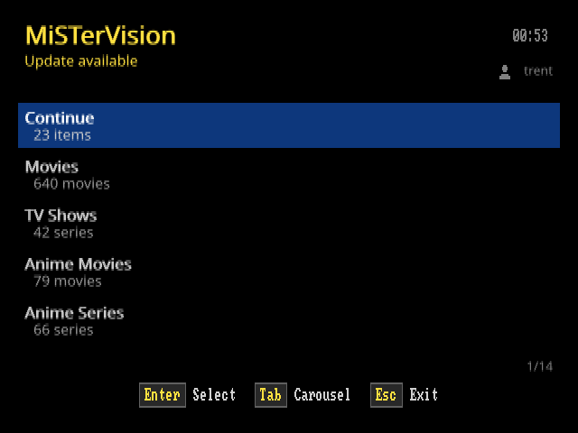
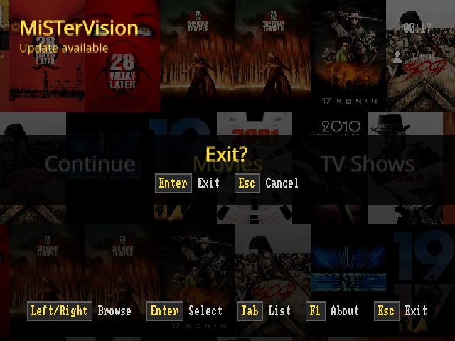
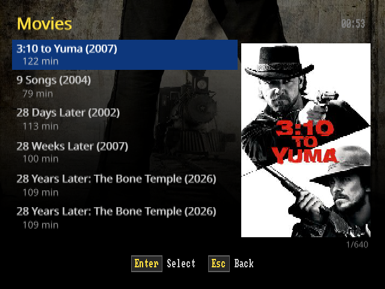
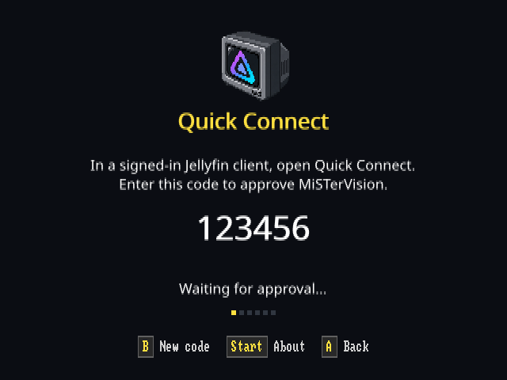
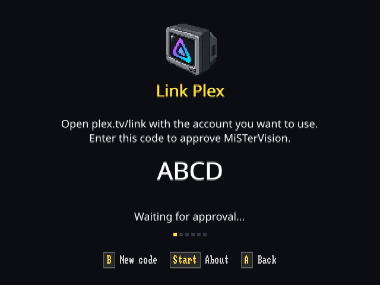
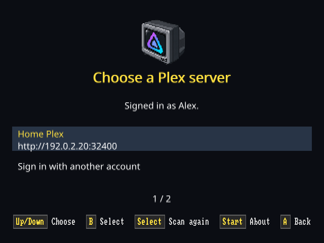
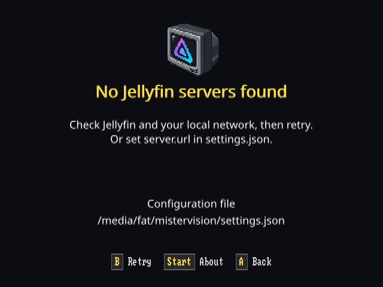
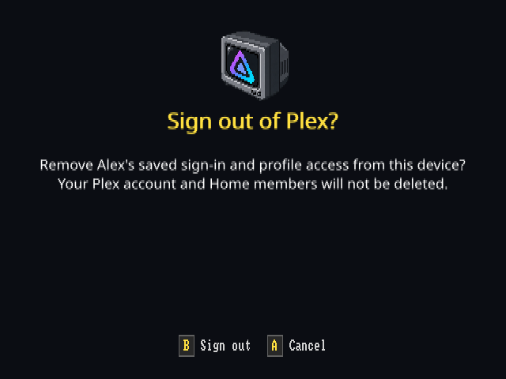

# Screenshots

These images show the v1.4.0 interface. Browsing images were captured from the desktop headless client using Jellyfin. Setup images use the production renderer with fictional names, addresses, and approval codes. Alex’s sample avatar is the project logo, not a real account image.

The shared UI uses a 640×240 logical frame for NTSC. These PNGs double its rows to show the intended 4:3 proportions at 640×480. They do not show CRT scanout, interlace, animation, or video smoothness. Browsing captures show keyboard hints. Setup previews show the default MiSTer controller hints.

## Browsing

The home carousel and root List view show the same update notice and active viewer. The home List view also shows each library’s count. Lists use bold titles and indented subtext. Library artwork is vertically centered in the wider information column.

| Home List view | Exit confirmation |
| --- | --- |
|  |  |

| Home carousel | Continue Watching |
| --- | --- |
|  |  |

| Movie list | Movie details |
| --- | --- |
|  |  |

## Connections and sign-in

Open About with Start on a controller or F1 on a keyboard, then press Down for Connections. **Use existing connection** appears only when a configured, remembered, or current connection is available.

| Connection choices | Jellyfin discovery |
| --- | --- |
|  |  |

| Jellyfin Quick Connect | Plex account linking |
| --- | --- |
|  |  |

| Plex server selection | Setup help |
| --- | --- |
|  |  |

See [Jellyfin setup](GO_BROWSING.md#setup-and-sign-in), [Plex discovery](GO_PLEX.md#server-discovery), and [saved connections](GO_CONFIGURATION.md#multiple-connections).

## Saved Jellyfin users

Each saved user has approved Quick Connect independently. Select a user to switch libraries and viewing history. Add user starts another approval. Forget user removes the selected saved sign-in after confirmation.


See [Jellyfin user switching](GO_BROWSING.md#jellyfin-users).

## Plex Home

The profile picker shows three cards at a time. Left/Right scrolls through additional viewers, and a counter shows the selection’s position. Protected viewers use the controller or keyboard keypad. The fourth digit submits the PIN. Digits and action labels are centered in their selection blocks.

| Viewing profiles | PIN entry |
| --- | --- |
|  |  |

| About and account controls | Plex sign-out confirmation |
| --- | --- |
|  |  |

See [Plex Home behavior](GO_PLEX.md#plex-home-profiles) for remembered viewers, retry messages, cancellation, and permissions.

About keeps its logo, identity block, and navigation hints steady while checking for updates. The checking message stays visible for at least one second. Exit confirmation uses a full-width translucent stripe with equal top and bottom padding.

## Announcement images

The [v1.4.0 announcement images](images/announcements/v1.4.0/README.md) include the Akira, Hackers, and Dungeons & Dragons episode launch screens, plus Kids TV Shows with Dungeons & Dragons selected and the Plex Live TV channel guide.

## Refreshing previews

From the repository root, regenerate the setup and About images with:

```sh
DOCS_PREVIEW_DIR="$PWD/docs/images/screenshots" \
  go test ./internal/rendering -run '^TestDocumentationPreviews$' -count=1
```

The [preview fixtures](../internal/rendering/docs_preview_test.go) use the current `RasterRenderer`. The command needs no server, account, credentials, or MiSTer. Ordinary tests skip the exporter. Review each image after changing layouts, and keep fixture text aligned with the connection flow.

The browsing captures require the [desktop harness](../tools/ghostty/README.md) and a media library. Use isolated development state when capturing them. Export complete frames, preserve the physical 4:3 proportions, and check for private account details before adding images to the repository. Do not include real sign-in codes or credential files.
